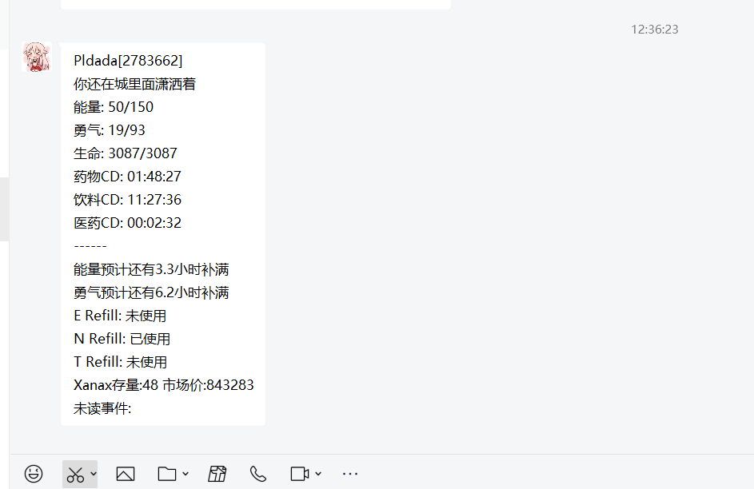
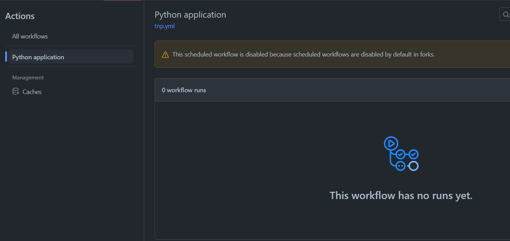

# Torn-ne-push（Torn报信）
[](https://github.com/Mostlai/Torn-ne-push/actions/workflows/tnp.yml)

<a href="mostlai.github.io"></a>

基于[Git action](https://github.com/Mostlai/Torn-ne-push/actions)和[Qmsg](https://qmsg.zendee.cn/)搭建的Torn报信仓库

## 有何功能

1. 基本信息提示
2. 爆NE预测
3. Refiil提示
4. 未读Event提示
5. 背包物品检测
6. 可能还有别的

## 使用效果



## 文件结构

```
│  .gitignore
│  LICENSE
│  main.py
│  README.md
│  requirements.txt
│  test.py
│  user_setting.py
│  
├─.github
│  └─workflows
│          tnp.yml

```

```
cron: '20 * * * *'
//每小时的第20分钟报时一次，延迟预计10min
```

## How to use

首先在[Qmsg](https://qmsg.zendee.cn/)登录并获取你的机器人KEY，注意你的QQ记得添加机器人为好友（不然怎么发消息给你）

然后Fork此仓库到你的Github账户下，顺便点个Star吧~

Fork之后在你的仓库下的Settings->Actions secrets and variables->Actions页面下点击New Repository secrets,在NAME处输入QMSG_KEY，在SECRET处输入你刚获取到的机器人KEY，然后点击Add secret，然后再次点击New Repository secrets,在NAME处输入TORN_KEY，在SECRET处输入你的TORN账户API KEY，Github是可靠平台，可以放Full access，点击Add secret

## 用户配置

点击仓库目录下的user_setting.py文件，然后点击小钱笔图标进行edit，修改完成后点击commit changes保存:

```
user_id = '2783662'  #此处填你的Torn ID
# 下为状态信息
in_ctiy_ok = '你还在城里面潇洒着'
in_hosp = '你看起来在医院潇洒 '
in_jail = '你看起来在监狱潇洒 '
in_travel = '你看起来在飞机上潇洒 '
# 下为通知设置
event_push = True  #是否打开未读事件提示，默认打开 True/False
refill_push = True  #是否打开Refill提示，默认打开 True/False
inventory_push = True  #是否打开背包物品数量检测，默认打开 True/False
inventory_list = ['Xanax']   #背包检测物品名称，例如inventory_list = ['Xanax','HEG']
```

## 最后

建议改一下.github/workflows/tnp.yml文件，比如cron: '20 * * * *'改成cron: '21 * * * *'，然后记得看一下你仓库的action页面，里面的workflow有没有打开



比如这种情况，你需要手动把这个工作流打开，之后他就会自动运行了